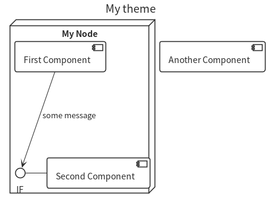
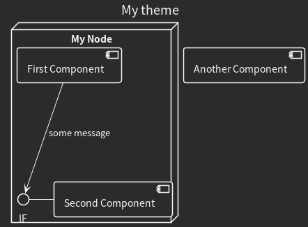
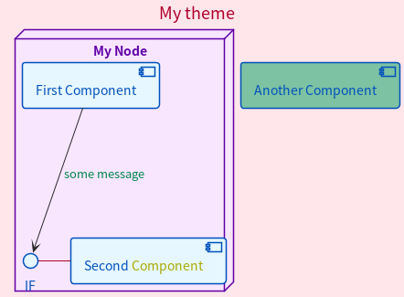

# Minimal and Customizable PlantUML Theme

# Usage

Insert the following snippet at the top of your PlantUML code.

`!include https://github.com/knukio/puml-theme-minimal/raw/main/puml-theme-minimal.puml`

Alternatively, you can download .puml file and then import the theme by

`!theme minimal from <download directory>`

## Default



By default, this is a simple monochrome theme.

## Dark

You can use dark theme by call `$dark()`.

```plantuml
@startuml
!include https://github.com/knukio/puml-theme-minimal/raw/main/puml-theme-minimal.puml

$dark()

...
```



## Custom

The following functions allow you to customize the style.

- `$set_global_skin(background, border, text, thickness)`
  - Sets the style for non-components.
- `$set_skins(background, border, text, background2, fill)`
  - Sets the style for major components (e.g. actor, database, rectangle, etc.).
  - Call before `$set_skin`.
- `$set_skin(background, border, text)`
  - It can be used inside `skinparam` to set the style of the component.
- `$color(content, color)`
  - Allows you to change the color of partial text.

Except for `$color`, if arguments are omitted, the default values will be used.

### Arguments

- `background`: background color
- `border`: border, line, and arrow color
- `text`: font color
- `thickness`: thickness of line and arrows. It takes a real number.
- `background2`: color for `LegendBackgroundColor` and `NoteBackgroundColor`
- `fill`: color for `BarColor`, `EndColor`, and `StartColor`
- `content`: text content.
- `color`: color for a text content.

### Preset Colors

Some colors are declared as variables.
Of course, the functions can also take any color code.

- `$GRAY`, `$GRAY2`, `$GRAY3`
- `$BLUE`, `$BLUE2`, `$BLUE3`
- `$RED`, `$RED2`, `$RED3`
- `$GREEN`, `$GREEN2`, `$GREEN3`
- `$PURPLE`, `$PURPLE2`, `$PURPLE3`

The first color in each line is a lighter color for backgrounds.

The second color in each line is a darker color for text and borders.

The third color in each line is the middle density.

### Example

```plantuml
@startuml
!include https://github.com/knukio/puml-theme-minimal/raw/main/puml-theme-minimal.puml

' global color is red
$set_global_skin($RED, $RED2, $RED2)
' components are blue
$set_skins($BLUE, $BLUE2, $BLUE2)
' node is purple
skinparam node {
  $set_skin($PURPLE, $PURPLE2, $PURPLE2)
}

title My theme

node "My Node" {
  ' text "Component" is yellow
  IF - [Second $color(Component, #aaaa00)]
  ' "some message" is green
  [First Component] --> IF : $color(some message, $GREEN2)
}

[Another Component]

@enduml
```


